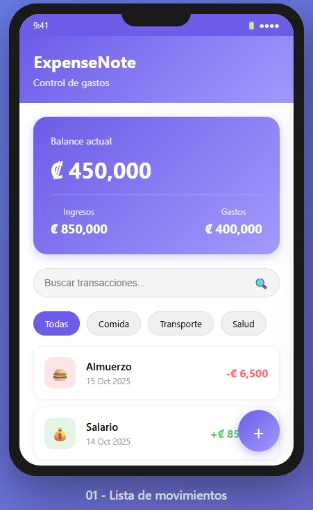
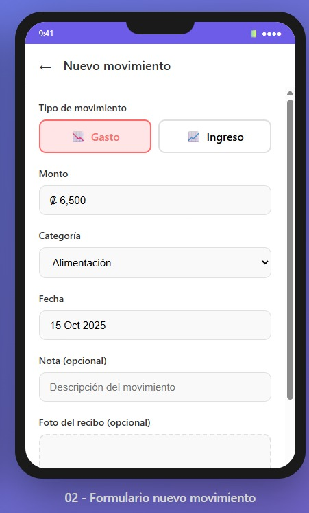
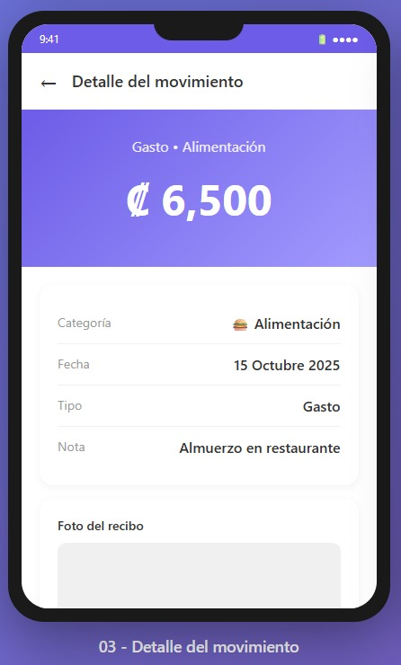
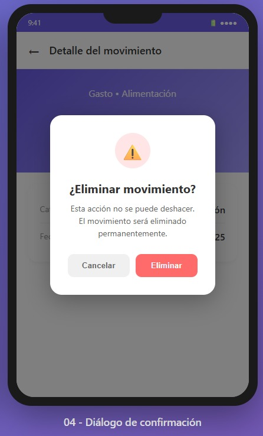
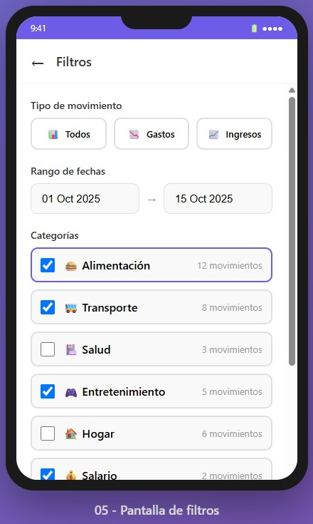

# 💸 ExpenseNote – Control de gastos personales

Aplicación Android desarrollada en **Kotlin** con Android Studio para registrar y gestionar gastos e ingresos personales.  
Permite crear, editar y eliminar movimientos, buscar por texto o categoría, y adjuntar una foto del recibo desde la cámara o galería.  
El proyecto tiene como objetivo aplicar los conocimientos de CRUD, manejo de listas personalizadas, uso de cámara/galería y diálogos en Android.

---

## 🧩 Descripción general

**ExpenseNote** es una app que ayuda a llevar un control sencillo de los gastos e ingresos personales.  
El usuario puede registrar transacciones, categorizarlas y visualizar su historial con filtros y búsqueda.

**Características principales:**
- CRUD completo de movimientos financieros (crear, editar, eliminar y ver).
- Campos: monto, tipo (gasto o ingreso), categoría, fecha, nota y foto opcional del recibo.
- Búsqueda por texto y filtros por rango de fechas o categoría.
- Adjuntar foto del recibo desde la cámara o galería.
- Diálogos de confirmación al eliminar o cancelar cambios.
- Almacenamiento local con **Room (SQLite)**.
- Interfaz intuitiva con enfoque en **buenas prácticas de UX**.

---

## ⚙️ Tecnologías utilizadas

- **Lenguaje:** Kotlin
- **IDE:** Android Studio
- **Base de datos local:** Room (SQLite)
- **Arquitectura:** MVVM (Model–View–ViewModel)
- **UI:** XML o Jetpack Compose (según lo requiera el curso)
- **Componentes Android Jetpack:** LiveData, ViewModel, Room
- **Control de versiones:** Git y GitHub

---

## 📱 Mockups de la aplicación

> Los mockups deben subirse como imágenes en la carpeta `/docs/mockups/`  
> Ejemplo de nombres:  
> `01_home.png`, `02_form.png`, `03_detail.png`, `04_dialog_delete.png`

### Pantallas principales
1. **Lista de movimientos**
    - Muestra los gastos e ingresos registrados.
    - Incluye barra de búsqueda, totales del periodo y filtros por categoría o fecha.
2. **Formulario de nuevo movimiento**
    - Permite registrar un nuevo gasto o ingreso.
    - Incluye campos de texto, selector de categoría, fecha y carga de imagen.
3. **Detalle del movimiento**
    - Muestra información completa del gasto o ingreso.
    - Botones para editar o eliminar.
4. **Diálogo de confirmación**
    - Aparece al eliminar o cancelar una acción.
5. **Pantalla de filtros (opcional)**
    - Selección de rango de fechas y categorías.

  
  
  

---

## 🚀 Flujo de trabajo (avances semanales)

Para mantener control de versiones y revisiones del profesor:

1. Trabajar en la rama `develop` o en ramas `feature/...`.
2. Crear un **Pull Request** hacia la rama `main`.
3. Asignar al profesor **@ebarahonautn** como revisor.
4. Esperar su aprobación (1 code review obligatorio).
5. Solo después de la aprobación se podrá hacer el merge a `main`.

> 🔒 La rama `main` está protegida: no se permiten commits ni push directos.

---

## 📋 Entregables

- **README.md:** incluye descripción del proyecto y mockups.
- **Repositorio GitHub:** con el profesor agregado como colaborador con permisos *Write*.
- **Avances semanales:** se suben por Pull Request para revisión.
- **URL del repositorio:** se entrega en el campus virtual.

---

## 👨‍🏫 Profesor

- **Nombre:** Esteban Barahona
- **Correo:** ebarahona@utn.ac.cr
- **GitHub:** [ebarahonautn](https://github.com/ebarahonautn)

---

## 👤 Autor

- **Nombre:** (Michael Carranza Porras)
- **Correo:** (micarranzapo@est.utn.ac.cr)
- **GitHub:** [Doosu03](https://github.com/Doosu03)
- **Universidad:** Universidad Técnica Nacional – Costa Rica

---

## 🏁 Estado del proyecto

- ✅ Configuración inicial del repositorio (main y develop).
- ✅ Rama `main` protegida con revisión obligatoria.
- ✅ Profesor agregado con permiso *Write*.
- 🔄 En desarrollo: diseño de pantallas y creación de mockups.
- ⏳ Próximos pasos: implementación de CRUD y base de datos Room.

